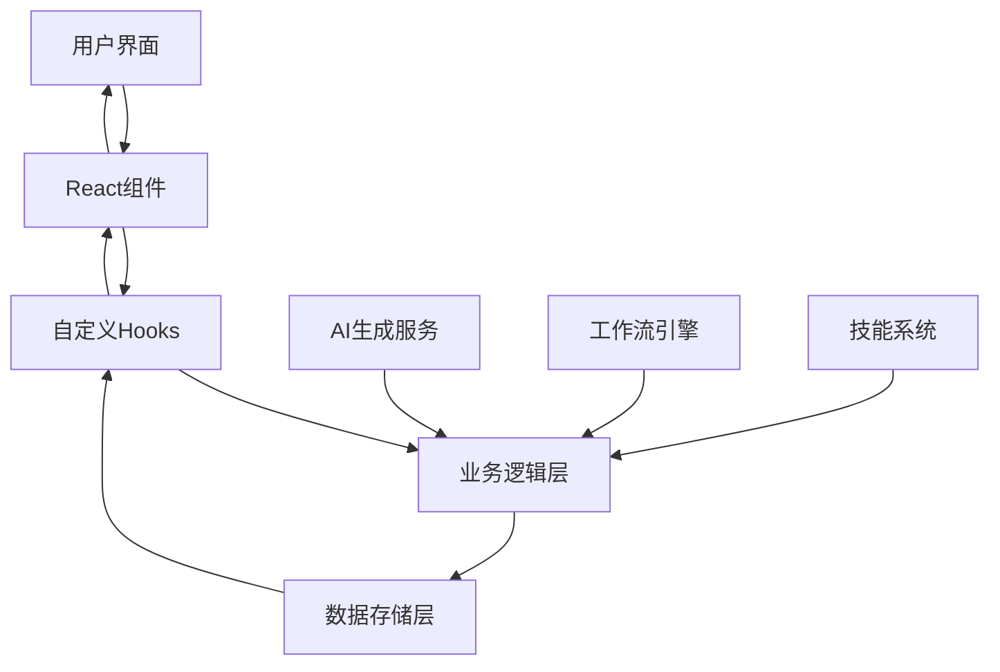
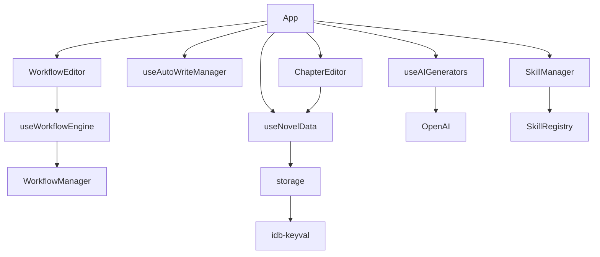

# AI小说写作工具 - Code Wiki

## 1. 项目概述

AI小说写作工具是一个基于React和TypeScript的web应用，旨在帮助用户通过AI辅助创作小说。该工具提供了完整的小说创作工作流，包括大纲生成、人物设定、世界观构建、章节写作等功能，并支持可视化工作流编辑器和技能系统。

### 主要功能
- 小说管理（创建、编辑、删除小说）
- 章节管理（创建、编辑、删除章节，支持分卷）
- AI生成（大纲、人物、世界观、灵感、情节大纲）
- 可视化工作流编辑器
- 技能系统
- 参考资料管理
- 章节版本控制
- 自动摘要生成
- 多模式章节编号（全局编号和分卷独立编号）

## 2. 目录结构

项目采用模块化架构，清晰分离了不同功能模块。核心代码位于`src`目录，包含组件、工具、钩子函数等。项目使用Vite作为构建工具，TypeScript确保类型安全。

```
├── src/
│   ├── components/         # 组件目录
│   │   ├── Editor/         # 编辑器相关组件
│   │   ├── Layout/         # 布局相关组件
│   │   ├── Modals/         # 弹窗组件
│   │   ├── Workflow/       # 工作流相关组件
│   │   └── *.tsx           # 其他组件
│   ├── constants/          # 常量定义
│   ├── contexts/           # React上下文
│   ├── hooks/              # 自定义钩子
│   ├── skills/             # 技能系统
│   ├── utils/              # 工具函数
│   ├── App.tsx             # 应用主组件
│   ├── main.tsx            # 应用入口
│   ├── types.ts            # 类型定义
│   └── index.css           # 全局样式
├── docs/                   # 文档
├── plans/                  # 计划
├── skills/                 # 技能定义
├── package.json            # 项目配置
├── tsconfig.json           # TypeScript配置
└── vite.config.ts          # Vite配置
```

## 3. 系统架构

### 3.1 整体架构

项目采用React + TypeScript + Vite的技术栈，使用Context API进行状态管理，结合自定义Hooks封装业务逻辑。系统分为以下几个核心层次：

1. **UI层**：React组件，负责用户界面渲染
2. **状态管理层**：自定义Hooks和Context，管理应用状态
3. **业务逻辑层**：工具函数和服务，处理核心业务逻辑
4. **数据存储层**：本地存储，持久化用户数据

### 3.2 核心流程图



## 4. 核心模块

### 4.1 小说数据管理

小说数据管理是整个应用的核心，通过`useNovelData`钩子实现。该模块负责：

- 小说的创建、编辑、删除
- 章节的管理（创建、编辑、删除、移动）
- 分卷的管理（创建、编辑、删除）
- 数据的持久化存储
- 章节编号模式切换（全局编号/分卷独立编号）

**主要功能**：
- 自动保存机制（防抖处理）
- 数据修复（处理丢失的分卷信息）
- 章节版本管理
- 章节编号自动校准

### 4.2 AI生成系统

AI生成系统通过`useAIGenerators`钩子实现，集成了OpenAI API，支持：

- 大纲生成
- 人物设定生成
- 世界观构建
- 灵感生成
- 情节大纲生成

**特点**：
- 支持多种生成模式（生成/聊天）
- 可配置的生成参数
- 参考资料整合
- 多模型支持

### 4.3 工作流系统

工作流系统是一个可视化的流程编辑器，使用`@xyflow/react`库实现，支持：

- 节点拖拽和连接
- 自定义节点类型
- 工作流执行和监控
- 循环和条件逻辑

**核心组件**：
- WorkflowEditor：工作流编辑器主组件
- WorkflowNode：工作流节点
- WorkflowEdge：工作流边
- useWorkflowEngine：工作流执行引擎

### 4.4 技能系统

技能系统允许用户扩展应用功能，通过`SkillRegistry`管理，支持：

- 内置技能和自定义技能
- 技能触发和执行
- 技能配置和管理

**主要技能**：
- 章节写作
- 人物设计
- 大纲规划
- 故事结构分析
- 风格润色
- 世界观构建

### 4.5 存储系统

存储系统通过`storage`工具实现，使用`idb-keyval`库进行本地存储，支持：

- 小说数据存储
- 章节内容存储
- 章节版本存储
- 配置存储

**特点**：
- 自动保存
- 数据备份和恢复
- 性能优化（防抖存储）

## 5. 关键类与函数

### 5.1 useNovelData

**路径**：[src/hooks/useNovelData.ts](file:///workspace/src/hooks/useNovelData.ts)

**功能**：管理小说数据的核心钩子，提供小说、章节、分卷的完整管理功能。

**主要方法**：
- `addNovel()`：创建新小说
- `deleteNovel()`：删除小说
- `addChapter()`：添加章节
- `deleteChapter()`：删除章节
- `addVolume()`：添加分卷
- `deleteVolume()`：删除分卷
- `moveChapterOrder()`：调整章节顺序
- `switchChapterNumberingMode()`：切换章节编号模式

**参数**：无

**返回值**：包含小说数据和操作方法的对象

### 5.2 useAIGenerators

**路径**：[src/hooks/useAIGenerators.ts](file:///workspace/src/hooks/useAIGenerators.ts)

**功能**：处理AI生成相关逻辑，集成OpenAI API。

**主要方法**：
- `handleGenerateOutline()`：生成大纲
- `handleGenerateCharacters()`：生成人物设定
- `handleGenerateWorldview()`：生成世界观
- `handleGenerateInspiration()`：生成灵感
- `handleGeneratePlotOutline()`：生成情节大纲

**参数**：无

**返回值**：包含AI生成方法的对象

### 5.3 WorkflowManager

**路径**：[src/utils/WorkflowManager.ts](file:///workspace/src/utils/WorkflowManager.ts)

**功能**：管理工作流的执行和状态。

**主要方法**：
- `getState()`：获取工作流状态
- `setState()`：设置工作流状态
- `executeWorkflow()`：执行工作流
- `pauseWorkflow()`：暂停工作流
- `resumeWorkflow()`：恢复工作流

**参数**：无

**返回值**：工作流管理实例

### 5.4 SkillRegistry

**路径**：[src/skills/SkillRegistry.ts](file:///workspace/src/skills/SkillRegistry.ts)

**功能**：管理技能的注册和执行。

**主要方法**：
- `registerSkill()`：注册技能
- `getSkill()`：获取技能
- `executeSkill()`：执行技能
- `getEnabledSkillCount()`：获取启用的技能数量

**参数**：无

**返回值**：技能注册中心实例

### 5.5 storage

**路径**：[src/utils/storage.ts](file:///workspace/src/utils/storage.ts)

**功能**：提供本地存储功能。

**主要方法**：
- `saveNovels()`：保存小说数据
- `getNovels()`：获取小说数据
- `saveChapterContent()`：保存章节内容
- `getChapterContent()`：获取章节内容
- `saveChapterVersions()`：保存章节版本
- `getChapterVersions()`：获取章节版本

**参数**：根据具体方法而定

**返回值**：Promise，包含存储操作结果

## 6. 数据结构

### 6.1 核心数据类型

**Novel**：小说数据结构
```typescript
interface Novel {
  id: string;
  title: string;
  chapters: Chapter[];
  volumes: NovelVolume[];
  systemPrompt: string;
  createdAt: number;
  coverUrl?: string;
  description?: string;
  category?: string;
  status?: '连载中' | '已完结';
  outlineSets?: OutlineSet[];
  characterSets?: CharacterSet[];
  worldviewSets?: WorldviewSet[];
  inspirationSets?: InspirationSet[];
  plotOutlineSets?: PlotOutlineSet[];
  referenceFiles?: ReferenceFile[];
  referenceFolders?: ReferenceFolder[];
  chapterNumberingMode?: 'global' | 'perVolume';
}
```

**Chapter**：章节数据结构
```typescript
interface Chapter {
  id: number;
  title: string;
  content: string;
  volumeId?: string;
  versions?: ChapterVersion[];
  activeVersionId?: string;
  activeOptimizePresetId?: string;
  activeAnalysisPresetId?: string;
  analysisResult?: string;
  logicScore?: number;
  subtype?: 'story' | 'small_summary' | 'big_summary';
  summaryRange?: string;
  summaryRangeVolume?: string;
  globalIndex?: number;
  volumeIndex?: number;
}
```

**NovelVolume**：分卷数据结构
```typescript
interface NovelVolume {
  id: string;
  title: string;
  collapsed: boolean;
}
```

**WorkflowGlobalContext**：工作流全局上下文
```typescript
interface WorkflowGlobalContext {
  variables: Record<string, any>;
  activeVolumeAnchor?: string;
  pendingSplitChapter?: string;
  pendingNextVolumeName?: string;
  pendingSplits?: WorkflowSplitRule[];
  volumePlans?: VolumePlan[];
  volumeEndChapters?: VolumeEndChapter[];
  executionStack: any[];
}
```

## 7. 依赖关系

### 7.1 核心依赖

| 依赖 | 版本 | 用途 |
|------|------|------|
| React | ^18.2.0 | 前端框架 |
| TypeScript | ^5.2.2 | 类型系统 |
| Vite | ^5.0.8 | 构建工具 |
| @xyflow/react | ^12.10.2 | 工作流编辑器 |
| OpenAI | ^4.24.1 | AI API集成 |
| idb-keyval | ^6.2.2 | 本地存储 |
| lucide-react | ^0.300.0 | 图标库 |
| TailwindCSS | ^3.4.0 | 样式框架 |

### 7.2 模块依赖关系



## 8. 运行指南

### 8.1 开发环境

1. **安装依赖**
   ```bash
   npm install
   ```

2. **启动开发服务器**
   ```bash
   npm run dev
   ```

3. **构建生产版本**
   ```bash
   npm run build
   ```

4. **预览生产版本**
   ```bash
   npm run preview
   ```

### 8.2 服务器运行

项目包含两个服务器脚本：

1. **内存监控服务器**
   ```bash
   npm run monitor
   ```

2. **主服务器**
   ```bash
   npm run server
   ```

3. **同时启动服务器和开发环境**
   ```bash
   npm run all
   ```

### 8.3 环境配置

项目使用Vite作为构建工具，配置文件为`vite.config.ts`。主要配置包括：

- 端口设置
- 插件配置
- 构建选项

## 9. 关键功能使用指南

### 9.1 创建新小说

1. 在主界面点击"创建小说"按钮
2. 填写小说信息（标题、分卷名、封面等）
3. 选择章节编号模式（全局编号/分卷独立编号）
4. 点击"确认"按钮完成创建

### 9.2 使用AI生成功能

1. 在左侧边栏选择需要的生成模块（大纲、人物、世界观等）
2. 输入生成提示
3. 选择参考资料（可选）
4. 点击"生成"按钮
5. 等待AI生成结果
6. 编辑和保存生成结果

### 9.3 使用工作流编辑器

1. 点击顶部的"可视化工作流"按钮
2. 在工作流编辑器中拖拽节点创建流程
3. 连接节点形成工作流
4. 配置节点参数
5. 点击"运行"按钮执行工作流

### 9.4 管理章节和分卷

1. 在左侧边栏管理章节和分卷
2. 点击"添加分卷"按钮创建新分卷
3. 点击"添加章节"按钮在当前分卷添加章节
4. 拖拽章节调整顺序
5. 点击章节标题编辑章节内容

## 10. 项目特色

### 10.1 双模式章节编号

支持两种章节编号模式：
- **全局模式**：所有章节连续编号
- **分卷模式**：每个分卷内章节独立编号

### 10.2 智能摘要系统

自动生成章节摘要，支持：
- 小摘要：单章节摘要
- 大摘要：多章节综合摘要
- 分卷摘要：分卷内容摘要

### 10.3 工作流自动化

可视化工作流编辑器，支持：
- 节点拖拽和连接
- 自定义节点类型
- 循环和条件逻辑
- 工作流状态监控

### 10.4 技能扩展系统

可扩展的技能系统，支持：
- 内置技能和自定义技能
- 技能触发和执行
- 技能配置和管理

## 11. 常见问题与解决方案

### 11.1 数据丢失

**问题**：章节或分卷数据丢失

**解决方案**：
- 系统具有数据修复功能，会自动尝试恢复丢失的分卷信息
- 定期备份数据
- 使用浏览器的本地存储清理功能时要谨慎

### 11.2 AI生成失败

**问题**：AI生成功能失败

**解决方案**：
- 检查API密钥配置
- 检查网络连接
- 尝试调整生成参数
- 减少输入内容长度

### 11.3 工作流执行错误

**问题**：工作流执行过程中出错

**解决方案**：
- 检查工作流节点配置
- 检查节点连接是否正确
- 查看控制台错误信息
- 尝试重新执行工作流

## 12. 未来发展方向

1. **云存储集成**：支持将数据存储到云端
2. **多用户协作**：支持多人共同编辑小说
3. **更多AI模型支持**：集成更多AI模型
4. **移动端适配**：优化移动端体验
5. **导出格式扩展**：支持更多导出格式
6. **社区功能**：添加作品分享和评论功能
7. **高级工作流**：支持更复杂的工作流逻辑
8. **语音输入**：支持语音输入功能

## 13. 总结

AI小说写作工具是一个功能强大、架构清晰的小说创作辅助工具，通过集成AI技术和可视化工作流，为用户提供了全方位的小说创作支持。项目采用现代化的技术栈，具有良好的可扩展性和可维护性，为小说创作者提供了一个高效、智能的创作环境。

---

**文档版本**：1.0.0
**最后更新**：2026-04-10
**项目地址**：/workspace