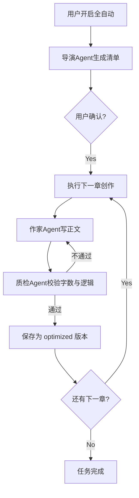

# Agent 协同创作可行性方案 (Feasibility Study)

本方案旨在现有“马良 AI 小说家”的基础上，构建一套自动化的 Agent 工具系统，实现从大纲到正文的自动化流水线。

## 1. 技术栈选择

* **开发语言**: `TypeScript` (保持与项目一致，确保类型安全)
* **状态管理**: `React Context` 或 `Zod` (用于 Schema 校验)
* **指令解析**: `Regex` + `JSON.parse` (处理 LLM 返回的特定 XML 标签)
* **执行环境**: 浏览器端 (通过现有的 API 调用能力)
* **模型支持**: OpenAI 协议兼容模型、Ollama (本地)、LM Studio

## 2. Agent 工具实现机制 (Tool Use)

Agent 不直接操作系统，而是通过在生成的文本中嵌入 **Action Tags**。

### 2.1 指令格式

采用类似自定义 XML 的格式，方便前端解析：

```xml
[ACTION:UPDATE_CHARACTER]{"name": "主角", "bio": "获得神剑"}[/ACTION]
```

### 2.2 核心解析器 (`src/utils/AgentParser.ts`)

```typescript
export const parseAgentActions = (text: string) => {
  const regex = /\[ACTION:(\w+)\](.*?)\[\/ACTION\]/g;
  const actions = [];
  let match;
  while ((match = regex.exec(text)) !== null) {
    actions.push({ type: match[1], payload: JSON.parse(match[2]) });
  }
  return actions;
};
```

### 2.3 工具映射表

将 Agent 指令映射到前端组件的 `Props` 方法：

* `ADD_CHARACTER` -> `onAddCharacter`
* `UPDATE_WORLDVIEW` -> `onUpdateWorldview`
* `APPEND_OUTLINE` -> `onAddOutlineItem`

## 3. Agent 启用与任务调度

### 3.1 任务清单制 (The Manifest)

启用全自动创作前，必须由“导演 Agent”生成一份清单。

1. **启动**: 用户点击“全自动创作”。
2. **规划**: 调用模型生成 `ChapterManifest`。
3. **确认**: 展示清单给用户，用户点击“开始执行”。

### 3.2 管道化执行 (Pipeline)



## 4. 用户参与机制

### 4.1 审核与预干预

* **清单确认**: 用户可以修改导演 Agent 生成的章节大纲。

* **实时监控**: 侧边栏显示 Agent 当前进度（如：“正在创作第3章... 预计字数 2000”）。

### 4.2 冲突解决 (Version Control)

* 所有 Agent 产出存入 `Chapter.versions`，类型标记为 `optimized`。

* 用户界面提供“对比”模式，点击“采纳”后才覆盖 `original`。

## 5. 新增文件说明 (Implementation Steps)

为实现此方案，建议创建以下文件：

1. [`src/utils/AgentCore.ts`](src/utils/AgentCore.ts): 负责 Agent 的状态流转与任务队列管理。
2. [`src/utils/AgentParser.ts`](src/utils/AgentParser.ts): 负责从文本中提取 `[ACTION]` 指令。
3. [`src/components/AgentControlPanel.tsx`](src/components/AgentControlPanel.tsx): UI 组件，展示进度、任务清单和干预按钮。
4. [`src/hooks/useAgentRunner.ts`](src/hooks/useAgentRunner.ts): React Hook，封装 Agent 的执行逻辑。

## 6. 代码实现示例 (伪代码)

```typescript
// 执行章节创作的函数
async function composeChapter(chapterId: string) {
    const context = buildContext(chapterId); // 获取角色、世界观快照
    const stream = await callLLM(context);
    
    stream.on('data', (chunk) => {
        // 实时解析 Action 标签，如果有更新世界观的行为，立刻在 UI 预警
        const actions = parseAgentActions(chunk);
        if (actions.length > 0) handleActions(actions);
    });
}
```

## 7. 安全与成本控制 (Safety & Cost Control)

为了防止 Agent 陷入死循环或意外消耗大量 API 额度，系统必须实现以下硬性限制：

### 7.1 最大重试与令牌限制

- **Max Retries**: 单个章节创作如果连续 3 次未通过“质检 Agent”的字数或逻辑校验，系统必须暂停并强制请求用户人工介入，而不是无限重试。
* **Token Budget**: 用户可以设置“单次自动化任务的最大消耗额度”（例如：$2.00 或 50,000 Tokens）。一旦达到阈值，Agent 自动进入休眠状态。

### 7.2 循环检测 (Loop Detection)

- **语义重复检查**: 解析器将计算新生成段落与前文的文本重合度。如果发现 Agent 在原地打转（即：连续三段内容高度相似），将触发“思维重置”提示词或终止任务。

### 7.3 紧急停机开关 (Emergency Kill Switch)

- UI 顶部常驻一个显眼的“停止所有 Agent”红色按钮。
* 该按钮将清空 `src/utils/AgentCore.ts` 中的任务队列，并立即断开所有活动的 HTTP 请求。

### 7.4 人工确认点 (Human-in-the-loop)

- **关键剧情确认**: 导演 Agent 生成 Manifest 后，必须由用户点击“确认执行”才能进入自动模式。
* **Action 确认**: 涉及删除或大规模修改现有设定（如删除重要角色）的 `[ACTION]` 必须由用户手动点击“允许”才能生效。

## 8. 结论

本方案在技术上完全可行。通过引入“清单制”任务管理和“人工确认点”，我们既能享受自动化的便利，又能确保 AI 创作不脱离用户的控制范围，且成本可控。
