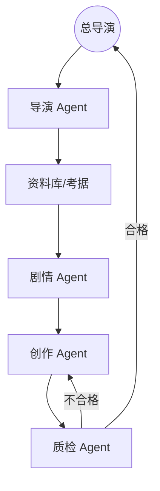

# AI 小说生成器项目深度规划设计计划书 (Swarm-based Novel Architect)

## 序言

在生成式 AI 技术突飞猛进的今天，创作工具已经从简单的“提示词-响应”模式进入了“智能体协同”的新时代。本项目旨在构建一个基于多智能体协同（Swarm Architecture）的深度小说创作工作站，解决长篇小说创作中的一致性、逻辑性、考据严谨性及文学性等核心痛点。本计划书详述了一套集“资料考据、脑洞激发、架构设计、自动执行、逻辑审计”于一体的全生命周期创作方案。

---

## 目录

1. [项目概述与核心愿景](#1-项目概述与核心愿景)
2. [资料库 (Reference Library) - 创作的硬核基石](#2-资料库-reference-library---创作的硬核基石)
3. [多 Agent 协同系统架构设计](#3-多-agent-协同系统架构设计)
4. [长效记忆与技术实现方案](#4-长效记忆与技术实现方案)
5. [核心功能模块规划](#5-核心功能模块规划)
6. [迭代路线图 (Roadmap)](#6-迭代路线图-roadmap)
7. [风险管理与合规性](#7-风险管理与合规性)

---

## 1. 项目概述与核心愿景

### 1.1 行业痛点

传统 AIGC 写作工具在面对长篇小说（30万字以上）时常表现出“遗忘症”与“平庸化”：

* **设定漂移**：AI 容易在后期推翻前期的核心设定。
* **考据困难**：创作者手中的参考资料难以高效“喂”给 AI 消化。
* **叙事单一**：缺乏复杂的伏笔铺设与多线索交叉。

### 1.2 核心愿景

我们要打造一个**“数字化编剧工作室”**。在这个工作室里，人类是掌握方向的“总导演”，而 AI 则是一群具备专业技能（考据、剧情、文笔、校对）的顶级幕僚。

---

## 2. 资料库 (Reference Library) - 创作的硬核基石

资料库组件位于“自动化创作中心”的第一顺位，是所有 Agent 获取“客观事实”的源泉。

### 2.1 组件功能

* **多模态资料载入**：支持用户上传 PDF、Word、TXT 附件（如：古代官职制度、量子物理理论、民俗画册等）。
* **自定义资料条目**：创作者可以直接手动录入考据笔记，支持 Markdown 编辑。
* **语义知识图谱**：系统对资料进行分块向量化，并构建知识关联，为后续的 Agent 提供 RAG（检索增强生成）支持。

### 2.2 写作时的考据联动

* 当用户或 Agent 在写作时，系统会自动实时检索资料库，在侧边栏弹出相关的背景知识，防止出现“常识性错误”或“设定吃书”。

---

## 3. 多 Agent 协同系统架构设计

基于博弈论设计的智能体集群（Swarm），通过互相制衡提升质量。

### 3.1 核心 Agent 角色

1. **导演 Agent (Director)**：负责整体工作流编排，解析用户指令，调度子 Agent。
2. **剧情架构 Agent (Plot Architect)**：负责三幕式结构设计、高潮点排布及伏笔管理。
3. **角色 Agent (Persona Keeper)**：维护角色成长曲线，确保每一章的行为逻辑符合人设。
4. **世界观 Agent (Lore Guardian)**：从资料库提取规则，守护力量体系与地理逻辑。
5. **创作 Agent (Ghostwriter)**：负责文学性输出，支持多种文风模拟。
6. **逻辑审计 Agent (Logic Critic)**：负责对初稿进行“找茬”，发现矛盾点并打回重写。

### 3.2 动态协作流

---

## 4. 长效记忆与技术实现方案

### 4.1 四层记忆金字塔

1. **滑动窗口**：保持对近万字文本的敏感度。
2. **递归摘要树**：通过层层总结，让 AI 即使写到第 1000 章也能记住第 1 章的开篇梗概。
3. **Graph-RAG**：利用图数据库维护复杂的人物关系网（如：父子、仇恨、暗恋）。
4. **语义库检索**：基于全文 Embedding，实现秒级的跨章节设定核对。

---

## 5. 核心功能模块规划

### 5.1 自动化创作中心 (Creation Center)

入口排序：**资料库 > 灵感 > 剧情粗纲 > 角色集 > 章节大纲 > 自动执行**。

### 5.2 逻辑热力图

实时监测全书逻辑健康度，红区表示设定冲突，绿区表示逻辑顺滑。

### 5.3 文风指纹锁定

通过对用户上传的样章分析，提取其特有的语感、节奏和遣词习惯，实现高度拟人化的续写。

---

## 6. 迭代路线图 (Roadmap)

* **Milestone 1：基础架构与资料库**
  * 上线附件上传与 RAG 检索功能。
  * 实现基本的“创作-质检”双 Agent 循环。
* **Milestone 2：深度 Swarm 协同**
  * 导演 Agent 自动化编排工作流。
  * 角色轨迹追踪系统。
* **Milestone 3：全自动 Autopilot**
  * 实现从脑洞到 50 万字初稿的全自动推演与质检。

---

## 7. 风险管理与合规性

* **幻觉抑制**：强制要求所有涉及设定的输出必须经过“资料库”与“世界观 Agent”的双重背书。

---

## 结语

本计划书通过多智能体协同与底层资料库的深度耦合，构建了一个从“考据”到“成稿”的一体化智能创作生态。它将极大地解放人类创作者的生产力，让写作回归到“创意”本身。
